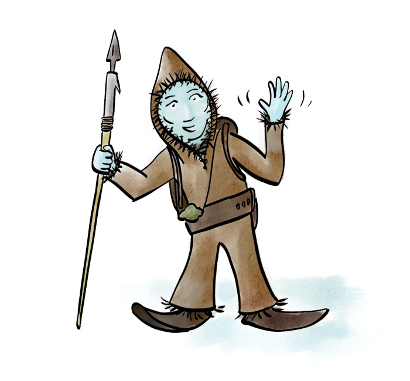

Nylnook website
===============

Code for the website at [nylnook.art](http://nylnook.art/), based on [DocPad](https://github.com/bevry/docpad) and the [HTML5 Boilerplate with grunt skeleton](https://github.com/lukekarrys/html5-boilerplate.docpad). 

## Technologies
Responsive design, Picture element, HTML5, CSS3, SVG icons...   
Internet Explorer before version 10 is not supported

## License
The code is licensed under [MIT License](http://creativecommons.org/licenses/MIT/)   
Images are licensed under various [Creative Commons](http://creativecommons.org/) Licenses, see each image directory for details.   
[Cantarell Font](http://abattis.org/cantarell/) by Dave Crossland, GPLv3 licence.   
The nylnook logo is © [Camille Bissuel](http://nylnook.art). All rights reserved.   

Other included things such as vendor libraries are likely already licensed by their own invidual licenses, so be sure to respect their licenses too.
